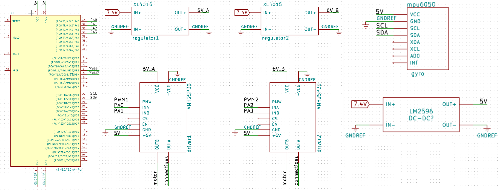

<!-- PROJECT SHIELDS -->
<!--
*** I'm using markdown "reference style" links for readability.
*** Reference links are enclosed in brackets [ ] instead of parentheses ( ).
*** See the bottom of this document for the declaration of the reference variables
*** for contributors-url, forks-url, etc. This is an optional, concise syntax you may use.
*** https://www.markdownguide.org/basic-syntax/#reference-style-links
-->

[![Contributors][contributors-shield]][contributors-url]
[![Forks][forks-shield]][forks-url]
[![Stargazers][stars-shield]][stars-url]
[![Issues][issues-shield]][issues-url]

<!-- PROJECT LOGO -->
<br />
<p align="center">

  <h1 align="center">Two Wheels Self Balancing Robot</h1>

  <p align="center">
    <a href="https://github.com/filipmanole/Self-Balance-Robot/issues">Report Bug</a>
    ·
    <a href="https://github.com/filipmanole/Self-Balance-Robot/issues">Request Feature</a>
  </p>
</p>

<!-- TABLE OF CONTENTS -->

## Table of Contents

- [About the Project](#about-the-project)
- [Software Tools](#software-tools)
- [Hardware](#hardware)
  - [Components](#Components)
  - [Electrical Circuit Diagram](#electrical-circuit-diagram)
- [Getting Started](#getting-started)
  - [Prerequisites](#prerequisites)
  - [Usage](#usage)
- [Roadmap](#roadmap)
- [Contributing](#contributing)
- [License](#license)

<!-- ABOUT THE PROJECT -->

## About The Project

This project covers the problem of an inverted pendulum. To stabilize the robot a PID controller is used, running at 100Hz. Using the angle of the robot, measured with the Absolute Orientation Sensor, the PID controller computes the speed value for the motors (duty cycle for PWM peripheral).

## Software Tools

- [Atmel Studio 7](https://www.microchip.com/mplab/avr-support/atmel-studio-7)
- ATmega_DFP 1.2.150 or later
- [avr-gcc](https://gcc.gnu.org/wiki/avr-gcc)

## Hardware

### Components
- LiPo Battery 7V4 2200mA
- [ATmega324](https://www.microchip.com/wwwproducts/en/ATMEGA324P)
- [2x Step Down Voltage XL4015](http://www.xlsemi.com/datasheet/XL4015%20datasheet.pdf)
- [Step Down LM2596](https://www.ti.com/lit/ds/symlink/lm2596.pdf?ts=1593460873307&ref_url=https%253A%252F%252Fwww.google.com%252F)
- [Adafruit BNO055 Absolute Orientation Sensor](https://learn.adafruit.com/adafruit-bno055-absolute-orientation-sensor)
- [2x Motor Driver VNH2SP30](https://www.pololu.com/file/0J52/vnh2sp30.pdf)
- [2x Pololu 1573](https://www.pololu.com/product/1573)

### Electrical circuit diagram



<!-- GETTING STARTED -->

## Getting Started

To get a local copy up and running follow these simple example steps.

### Prerequisites

Make sure you have installed the software environment and a hardware setup according to the schematic. To program the controller you will need [Atmel-ICE](http://ww1.microchip.com/downloads/en/DeviceDoc/Atmel-ICE_UserGuide.pdf).

Clone the repo:

```sh
git clone https://github.com/filipmanole/Self-Balance-Robot.git
```

<!-- USAGE EXAMPLES -->

### Usage

1. Open the Atmel Studio Solution
2. Right click on the project and select `Build`
3. Run the project

Note: The project might need another tunning for the PID controller.

<!-- ROADMAP -->

## Roadmap

See the [open issues](https://github.com/filipmanole/Self-Balance-Robot/issues) for a list of proposed features (and known issues).

<!-- CONTRIBUTING -->

## Contributing

Contributions are what make the open source community such an amazing place to be learn, inspire, and create. Any contributions you make are **greatly appreciated**.

1. Fork the Project
2. Create your Feature Branch (`git checkout -b feature/AmazingFeature`)
3. Commit your Changes (`git commit -m 'Add some AmazingFeature'`)
4. Push to the Branch (`git push origin feature/AmazingFeature`)
5. Open a Pull Request

<!-- LICENSE -->

## License

Distributed under the MIT License.

<!-- CONTACT -->

<!-- ACKNOWLEDGEMENTS -->

<!-- MARKDOWN LINKS & IMAGES -->
<!-- https://www.markdownguide.org/basic-syntax/#reference-style-links -->

[contributors-shield]: https://img.shields.io/github/contributors/filipmanole/Self-Balance-Robot.svg?style=flat-square
[contributors-url]: https://github.com/filipmanole/Self-Balance-Robot/graphs/contributors
[forks-shield]: https://img.shields.io/github/forks/filipmanole/Self-Balance-Robot.svg?style=flat-square
[forks-url]: https://github.com/filipmanole/Self-Balance-Robot/network/members
[stars-shield]: https://img.shields.io/github/stars/filipmanole/Self-Balance-Robot.svg?style=flat-square
[stars-url]: https://github.com/filipmanole/Self-Balance-Robot/stargazers
[issues-shield]: https://img.shields.io/github/issues/filipmanole/Self-Balance-Robot.svg?style=flat-square
[issues-url]: https://github.com/filipmanole/Self-Balance-Robot/issues
[linkedin-shield]: https://img.shields.io/badge/-LinkedIn-black.svg?style=flat-square&logo=linkedin&colorB=555
[linkedin-url]: https://www.linkedin.com/in/filip-george-manole/
[product-screenshot]: screenshot.png